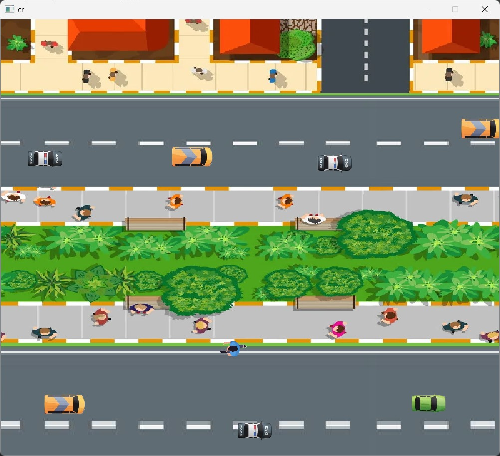
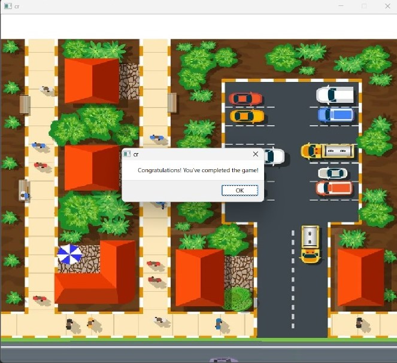
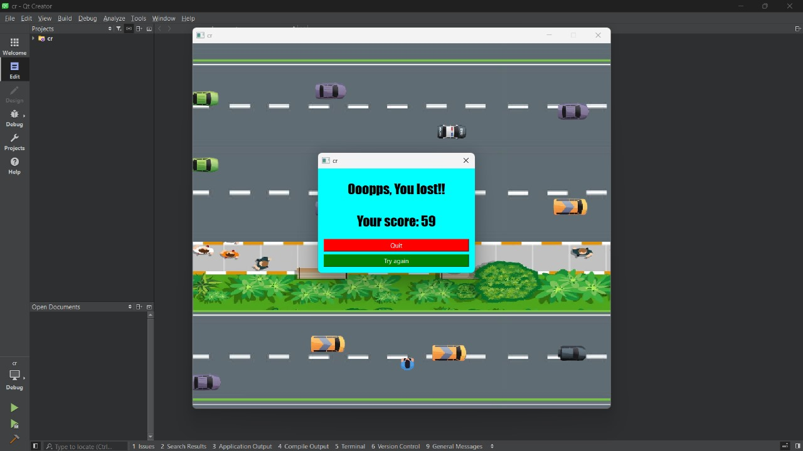
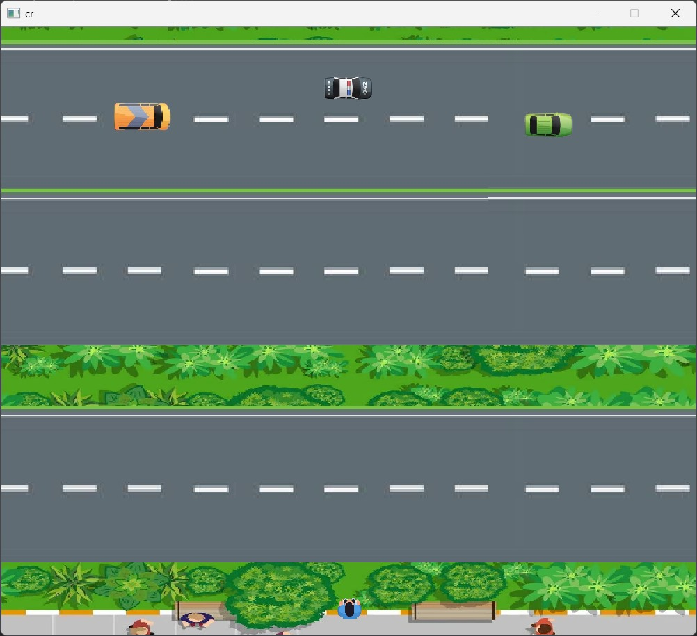

# Crossing Road Game

## Centered Heading

This paragraph is centered.

 
A classic crossing road game implemented using C++ and object-oriented programming (OOP) principles with the assistance of Qt Creator and its library.

## Overview:
This project aims to recreate the timeless crossing road game where the player navigates a character across a busy road while avoiding obstacles. The game utilizes C++ for its core logic and Qt Creator for graphical interface design, leveraging Qt's library for enhanced functionality and visual appeal.
 

## Features:
Player-controlled character movement.
Dynamic obstacle generation and movement.
Score tracking and display.
Collision detection and game over state.
Responsive graphical interface designed using Qt Creator.
Getting Started
To run the game locally, ensure you have Qt Creator installed. Clone this repository and open the project in Qt Creator. Build and run the project to start playing the game.

 

## Usage:
Use the arrow keys to navigate the character across the road.
Avoid oncoming obstacles to prevent collisions.
Score points by successfully reaching the other side of the road.
The game ends when the player collides with an obstacle.

 
# Contributors:
Mouad ismaili   github.com/MouadTs
